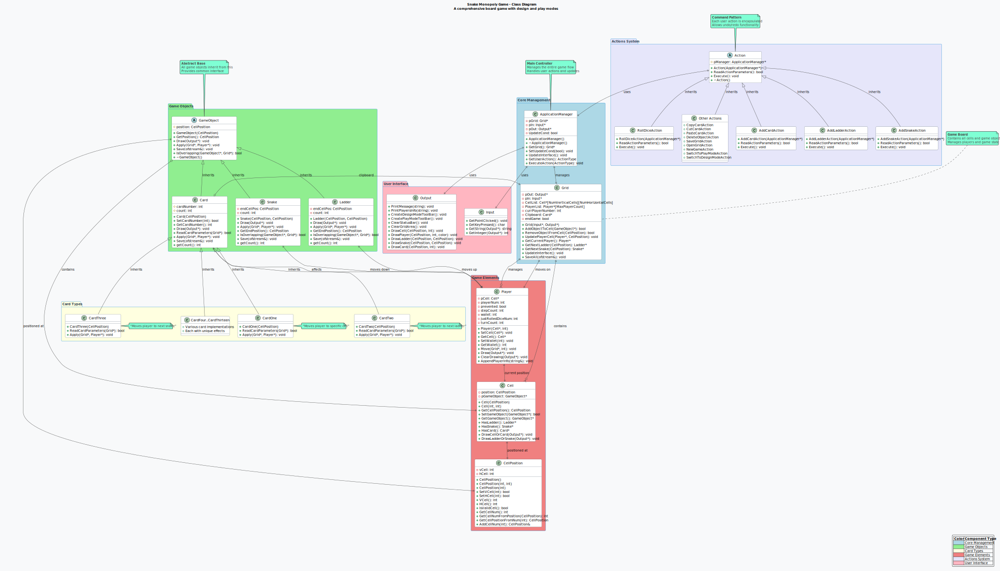

# SnakeMonopoly 🐍🎲

## Project Overview

SnakeMonopoly is a C++ project that simulates a board game similar to Snakes and Ladders, with additional features such as cards, players, and a graphical user interface. The project is structured using Object-Oriented Programming (OOP) principles to ensure modularity, reusability, and maintainability.

## 📸 Game Screenshots

### Design Mode

The design mode allows users to create and modify the game board by adding snakes, ladders, and cards.

### Play Mode

The play mode is where players can actually play the game, rolling dice and moving around the board.

## 📊 UML Class Diagram

The project architecture is documented through comprehensive UML diagrams showing the relationships between all classes:

### Class Diagram Overview

**Available Formats:**

- **SVG Format:** [`assets/uml/SnakeMonopolyClassDiagram.svg`](assets/uml/SnakeMonopolyClassDiagram.svg) - Scalable vector format
- **PDF Format:** [`assets/uml/SnakeMonopolyClassDiagram.pdf`](assets/uml/SnakeMonopolyClassDiagram.pdf) - Print-ready format

The UML diagram illustrates:

- **Core Management Classes** (ApplicationManager, Grid)
- **Game Objects Hierarchy** (GameObject, Card, Ladder, Snake)
- **Card Types** (CardOne through CardThirteen)
- **Game Elements** (Cell, Player, CellPosition)
- **Actions System** (Command pattern implementation)
- **User Interface** (Input/Output classes)

---

## OOP Design and Hierarchy

### 1. **Core Classes**

- **`ApplicationManager`**  
  The main controller class that manages the game flow, user actions, and coordinates between the UI and the game logic.

- **`Grid`**  
  Represents the game board. Manages cells, players, and game objects (ladders, snakes, cards).

- **`Cell`**  
  Represents a single cell on the grid. Can contain a game object.

- **`CellPosition`**  
  Encapsulates the position of a cell on the grid.

### 2. **Game Objects (Inheritance & Polymorphism)**

- **`GameObject`** (Abstract Base Class)  
  The base class for all objects that can be placed on the grid.

  - **`Ladder`**  
    Represents a ladder object.
  - **`Snake`**  
    Represents a snake object.
  - **`Card`** (Abstract)  
    Base class for all card types.
    - **`CardOne`, `CardTwo`, ...**  
      Derived classes for each specific card type, implementing their own behavior.

  This hierarchy demonstrates **inheritance** and **polymorphism**. The grid can store pointers to `GameObject`, allowing it to handle ladders, snakes, and cards uniformly.

### 3. **Player Class**

- **`Player`**  
  Represents a player in the game, holding information such as position, wallet, and turn logic.

### 4. **User Interface Classes**

- **`Input`**  
  Handles all user input (mouse clicks, keyboard input).

- **`Output`**  
  Handles all graphical output, drawing the grid, players, and messages.

- **`CMUgraphicsLib`**  
  A graphics library providing window management and drawing primitives.

### 5. **Supporting Files**

- **`DEFS.h`**  
  Contains global definitions and enumerations (e.g., `ActionType`).

- **`UI_Info.h`**  
  Stores UI configuration and constants.

---

## OOP Principles in the Project

- **Encapsulation:**  
  Each class encapsulates its own data and behavior. For example, `Player` manages its own state, and `Grid` manages the board state.

- **Inheritance:**  
  The `GameObject` class is the base for all objects that can be placed on the grid. Cards, ladders, and snakes inherit from `GameObject`.

- **Polymorphism:**  
  The grid and other components interact with game objects through base class pointers (`GameObject*`), allowing for flexible and extensible game logic.

- **Abstraction:**  
  Abstract classes like `GameObject` and `Card` define interfaces for derived classes, hiding implementation details.

---

## How to Build and Run

1. Open the project in your C++ IDE (e.g., Visual Studio).
2. Build the solution.
3. Run the executable.

---

## Extending the Project

Adding some Features like poison, fire, ice effects.  
Sounds for dice, snake, ladder can change the whole game.  
Making a Snake-Monopoly digital Game Guide.
---

## License

See [CMUgraphicsLib/version.h](CMUgraphicsLib/version.h) for licensing information regarding the graphics library.
